<p align="center">
<a href="https://doc.icuapi.com/">
    
</a>
<p align="center" style="color:black ; font-size: 25px">Castle知识库管理系统</p>

</p>
<p align="center">
<a href="https://gitee.com/hcwdc/knowledgebase">
    
</a>
<a href="https://www.oracle.com/java/technologies/javase/javase-jdk8-downloads.html">
    
</a>
<a target="_blank" href="https://spring.io">
    
</a>   
	<a href="https://gitee.com/hcwdc/knowledgebase/blob/master/LICENSE">
    
</a>

Castle知识库是一款集知识管理、智能检索、权限控制、文档处理与数据分析 于一体的综合型企业级知识服务平台。 为企业提供强有力的支撑，助力构建学习型组织与数字化知识生态。

本系统已在多个企业客户中成功商用，特别适用于需要对海量内部文件进行集中管理、按权限分级查看与检索下载的业务场景。若您所在企业有对文档进行查重检测、版本控制、安全分发等需求，本系统功能完全契合您的实际应用需求。


## 项目地址

| 项目                                                                        | Star                                                                                                                                                                                                                                                                              | 简介  |
|---------------------------------------------------------------------------|-----------------------------------------------------------------------------------------------------------------------------------------------------------------------------------------------------------------------------------------------------------------------------------|-----|
| [knowledgebase-member](https://gitee.com/hcwdc/knowledgebase-member)    | [](https://gitee.com/hcwdc/knowledgebase-member) | 用户端 |
| [knowledgebase](https://gitee.com/hcwdc/knowledgebase)     | [](https://gitee.com/hcwdc/knowledgebase)  | 后端  |


演示环境：http://knowledge.icuapi.com/dengLu   
演示账号：admin/admin   
文档地址：https://doc.icuapi.com/knowledge/gaishu   
操作手册地址：https://www.yuque.com/hcwdc/castleknowledge

## 快速运行（基于docker）

目前这套镜像只支持x86架构，如果是arm架构的话，可以自己拉代码去替换镜像~！

```
git clone https://gitee.com/hcwdc/knowledgebase.git
cd knowledgebase/docker

docker-compose up -d
```

> 注意事项：   
> 在执行完命令之后，由于MySql脚本较大，导入需要时间，所以请等待5~10分钟后进行使用   
> 如果进入页面显示502的话，可以重启一下

```
docker-compose restart
```


## 项目功能
<p align="center">
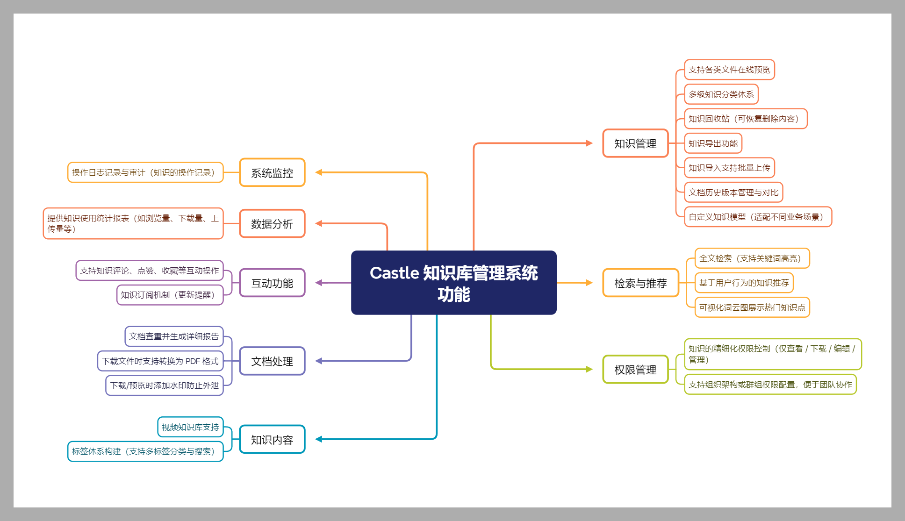
</p>

## 知识管理系统功能概览

| 模块         | 功能描述                                                                                                 |
|--------------|------------------------------------------------------------------------------------------------------|
| **知识管理** | 支持各类文件在线预览<br>多级知识分类体系<br>知识回收站（可恢复删除内容）<br>知识导出功能<br>知识导入支持批量上传<br>文档历史版本管理与对比<br>自定义知识模型（适配不同业务场景） |
| **检索与推荐** | 全文检索（支持关键词高亮）<br>基于用户行为的知识推荐<br>可视化词云图展示热门知识点                                                        |
| **权限管理** | 知识的精细化权限控制（仅查看 / 下载 / 编辑 / 管理）<br>支持组织架构或群组权限配置，便于团队协作                                               |
| **知识内容** | 视频知识库支持 <br>标签体系构建（支持多标签分类与搜索）                                                                       |
| **文档处理** | 文档查重并生成详细报告<br>下载文件时支持转换为 PDF 格式<br>下载/预览时添加水印防止外泄                                                   |
| **互动功能** | 支持知识评论、点赞、收藏等互动操作<br>知识订阅机制（更新提醒）                                                                    |
| **数据分析** | 提供知识使用统计报表（如浏览量、下载量、上传量等）                                                                            |
| **系统监控** | 操作日志记录与审计（知识的操作记录）                                                                                   |


## 查重说明
查重支持两种模式，单文件查重和本地库查重。
> 查重暂不支持文件内表格内容   
> 查重暂不支持图片文件

### 单文件查重说明
用户自主上传2个文件进行对比查重，系统进行对比查重。
### 本地库查重
用户上传某个文件，与知识库内的所有文件进行对比。

## 演示效果

前往查看演示视频：https://space.bilibili.com/51036827

<table>
    <tr>
        <td>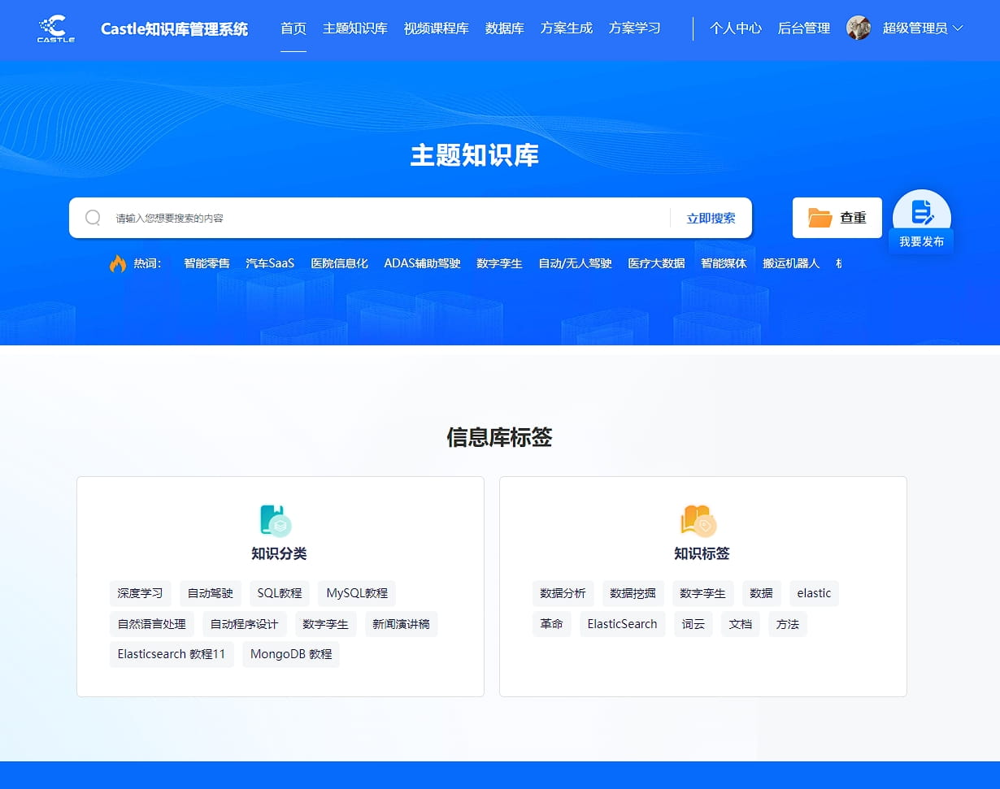</td>
        <td>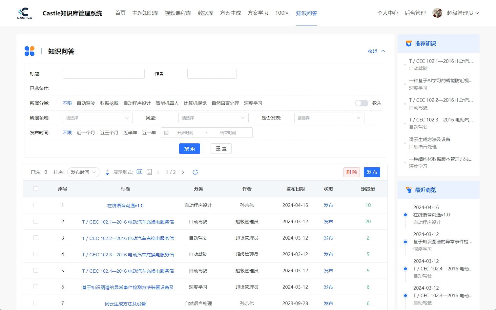</td>
    </tr>
    <tr>
        <td>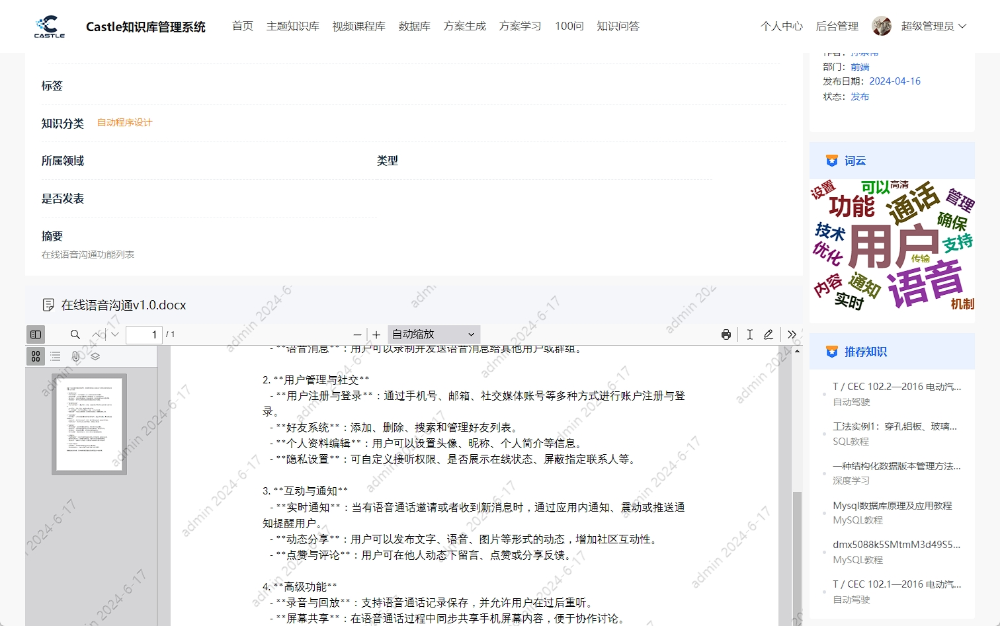</td>
        <td>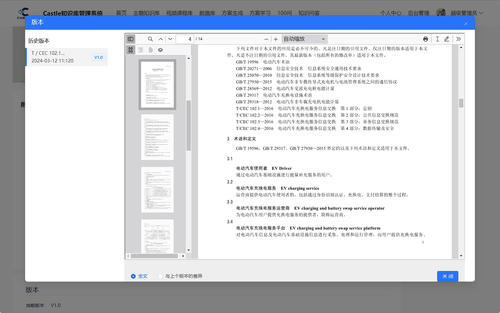</td>
    </tr>
    <tr>
        <td>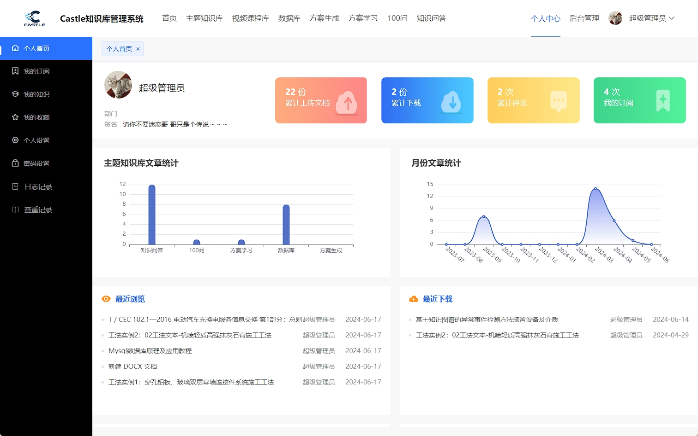</td>
        <td>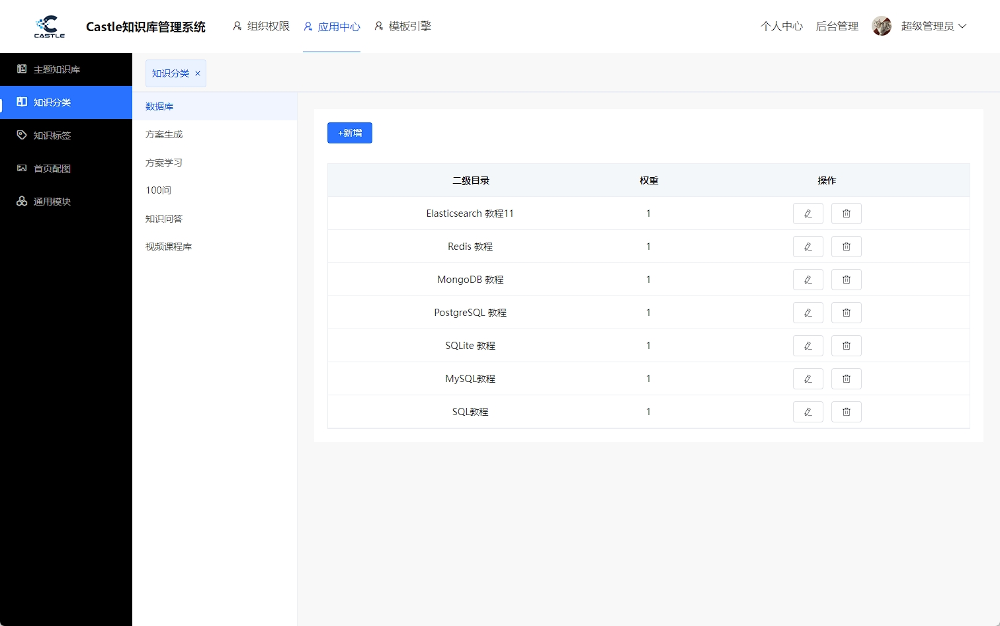</td>
    </tr>
    <tr>
        <td>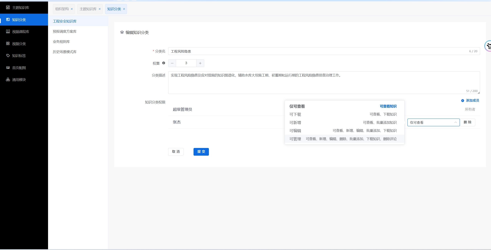</td>
        <td>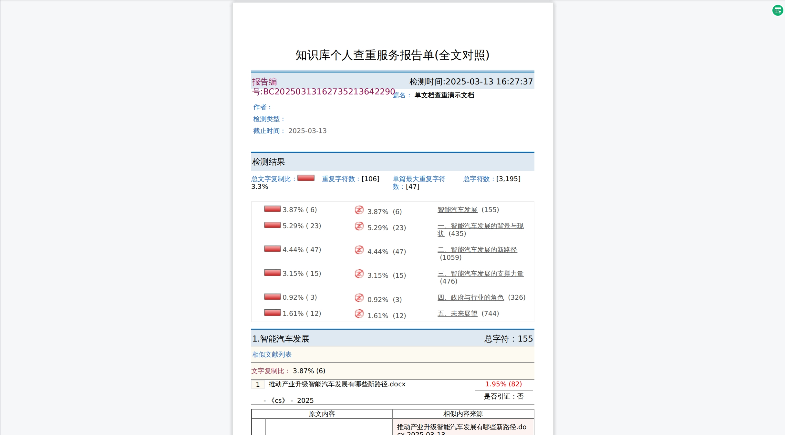</td>
    </tr>
    <tr>
        <td>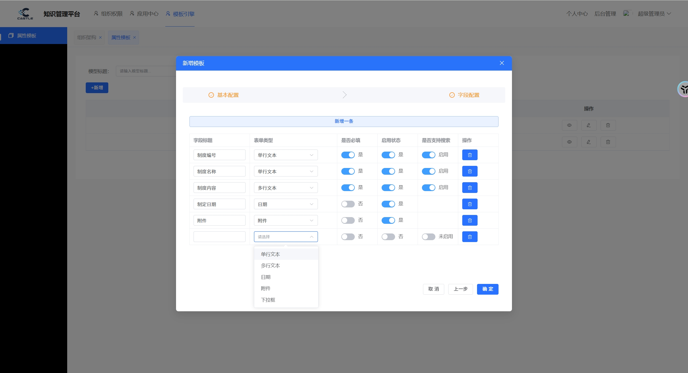</td>
        <td>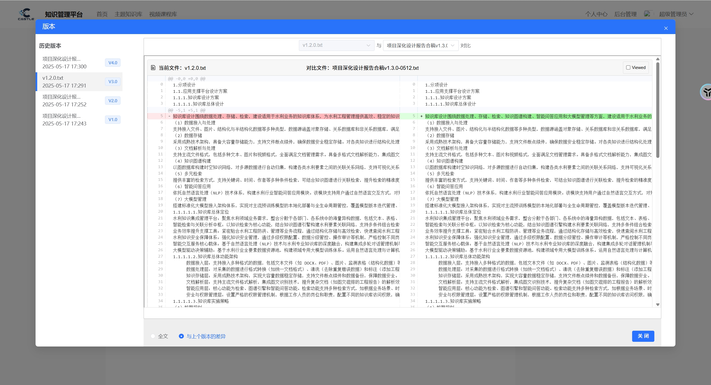</td>
    </tr>
</table>

欢迎提交 [issue](https://gitee.com/hcwdc/knowledgebase/issues)，请详细描述问题的原因、开发环境。

## 联系我们
如需进一步了解系统部署方案或定制开发服务，请联系我们的专业顾问团队。  
邮箱:sun@hcses.com 


